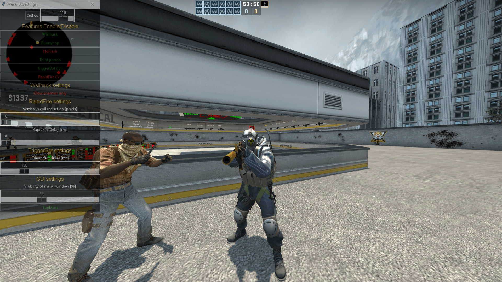
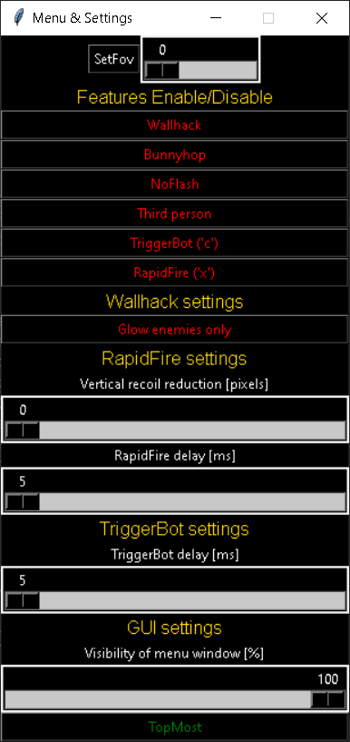

This is a self updating csgo multihack.

Features:
1) Wallhack
2) BunnyHop
3) Triggerbot
4) Fov changer
5) Third person
6) RapidFire

Config.ini:
1) Set default settings
2) Set bindings to RapidFire and Triggerbot

It has few settings to the TKINTER GUI (that looks as good as it was possible), triggerbot (delay), wallhack (glow enemies only), rapidfire (vertical recoil reduction, delay)...

It's self updating from hazedumper's repository. https://github.com/frk1/hazedumper

